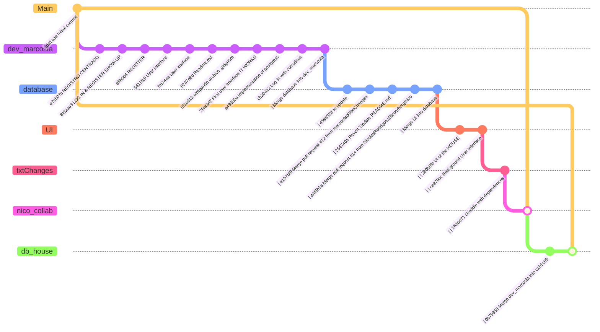

# RENTWISE CONTROL
 
## USER INTEFACE
We have created the first part of the user interface, the Log In, it does not work yet, but it is the first step to create the whole interface.

```mermaid
  %%{init: { 'logLevel': 'debug', 'theme': 'base', 'gitGraph': {'showBranches': true, 'showCommitLabel': true, 'mainBranchName': 'Main'}} }%%
gitGraph
  commit id:"3da1a3e Initial commit"
  branch dev_marcosfa
    commit id:"e7c507c REGISTRO CENTRADO"
    commit id:"8fd2aa3 LOG IN & REGISTER SHOW-UP"
    commit id:"8ffb004 REGISTER"
    commit id:"5411f19 User interface"
    commit id:"7f6744a User inteface"
    commit id:"6247e8d Readme.md"
    commit id:"0f1e913 afregando archivo .gitignore"
    commit id:"2f4a3d2 First user Interface IT WORKS"
    commit id:"e43980a implementation of postgress"
    commit id:"cb20412 Log In with corrutines"
    commit id:"| Merge database into dev_marcosfa"
    branch database
      commit id:"| 4598328 to update"
      commit id:"| e157b8f Merge pull request #12 from marcosfa00/txtChanges"
      commit id:"| 254740a Revert 'Update README.md'"
      commit id:"| a4f8b1a Merge pull request #14 from NicolasRodriguezSteuerberg/nico"
      commit id:"| Merge UI into database"
      branch UI
        commit id:"| | 280b0fb UI of the HOUSE"
        commit id:"| | ce979cc Background User Interface"
        branch txtChanges
          commit id:"| | 1636d71 Graddle with dependences"
          branch nico_collab
          merge Main
        branch db_house
  commit id:"| 0b79358 Merge dev_marcosfa into c161c69"
  merge Main


```